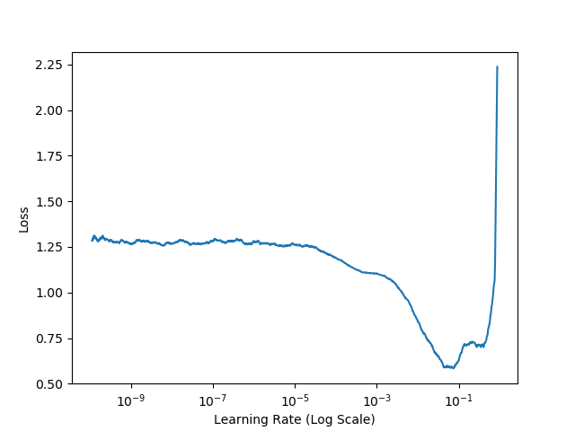
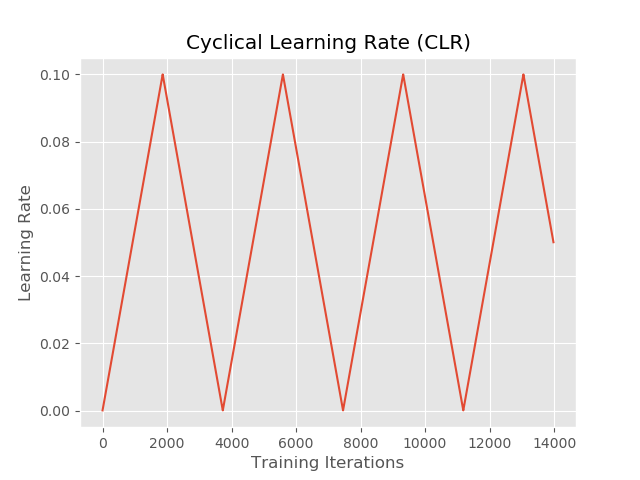

# a method of finding learning_rate 
- **LearningRateFinder.py--this .py file is the class of finding learning_rate**
- **config.py -- this .py file includes some configuration of learning_rate and the path of finding_learning_rate png img**
- **clr_callback.py -- this .py file is the CLR method**


# Usage
- **first: you can run your model with finding_learning_rate in terminal by using parameter**
- **the -f was setted by default 0,if you set it to 1,then the  LearningRateFinder function will be activated**


```python
ap = argparse.ArgumentParser()
ap.add_argument("-f", "--lr-find", type=int, default=0,
help="whether or not to find optimal learning rate")
    if args["lr_find"]>0:
    print('[INFO] finding learing rate...')
    lrf = LearningRateFinder(top_model)
    lrf.find(
        train_datagen.flow(train_images,Y_train,batch_size=batch_size_for_generators),
        1e-10,1e+1,
        stepsPerEpoch=np.ceil((len(train_images)/float(batch_size_for_generators))),
        batchSize=batch_size_for_generators
    )
    lrf.plot_loss()
    plt.savefig(config.LRFIND_PLOT_PATH)
    print('[INFO] learing rate finder complete')
    print('[INFO] examin plot and adjust learing rates before training')
    sys.exit(0)
```


 **next: when the finding_learning_rate function quitted,you can find the png img in your own setted path,**
 
 **and then you can rewrite the config.py by updating the mix_lr and max_lr**
 **you can use CLR method just like code below:**
```python
clr = CyclicLR(
    mode=config.CLR_METHOD,
    base_lr=config.MIN_LR,
    max_lr=config.MAX_LR,
    step_size=stepSize
)
```
 **clr is the callback of returned,you can transit it into your model.fit_generator,like that:**
```python
top_model.fit_generator(
    train_datagen.flow(train_images,Y_train,batch_size=config.BATCH_SIZE),
    validation_data=valid_gen,
    steps_per_epoch=train_images.shape[0] // batch_size_for_generators,
    validation_steps=valid_images.shape[0] // batch_size_for_generators,
    epochs=config.NUM_EPOCHS,
    callbacks=[clr],
    verbose=1
)
```
